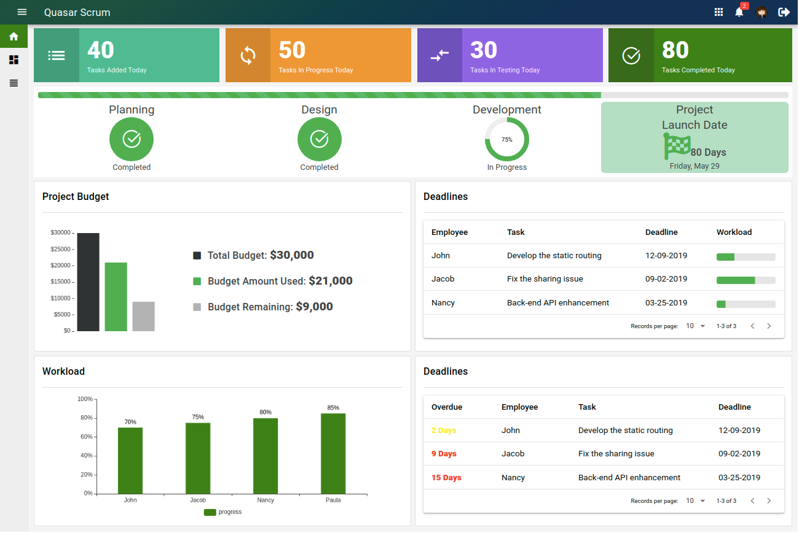

# Quasar Scrum

Quasar Scrum - Agile process framework for managing complex tasks

Features:
* Dashboard
* Taskboard Grid View
* Taskboard List View
* Homepage with basic details, pricing

## Site: [https://quasar-scrum.netlify.com/](https://quasar-scrum.netlify.com/)

# Support

If this project helped you, feel free to contribute by providing feedback or supporting the ongoing maintenance of this repository.

Please reach out via the contact information below for any inquiries regarding the project or potential collaborations.

Thank you very much!

## Resources used
* [Quasar Framework](https://quasar.dev/)
* [Vue.js](https://vuejs.org/)

## Installation

* **Clone the repository**

```
git clone https://github.com/rushikiranadiboina/quasar-scrum.git
```

## Install the dependencies
```bash
cd quasar-scrum
npm install
```

### To run the app in development mode (hot-code reloading, error reporting, etc.)
```bash
quasar dev
```


### Build the application
```bash
quasar build
```

Do reach out to me at "rushikiranadiboina@gmail.com" for queries.

## Screens UI
**Dashboard Home**
<p float="left">
        <kbd>

                </kbd>
</p>

**Grid View**
<p float="left">
	<kbd>

		</kbd>
</p>

**List View**
<p float="left">
	<kbd>

	</kbd>
</p>

**Homepage**
<p float="left">
	<kbd>
	
	</kbd>
</p>

### Customize the configuration
See [Configuring quasar.conf.js](https://quasar.dev/quasar-cli/quasar-conf-js).

## License

[MIT](http://opensource.org/licenses/MIT)

## Maintainer

Rushi Kiran Adiboina is a Full Stack Developer with over 6 years of experience designing, developing, and supporting scalable enterprise applications. He has extensive hands-on experience with React.js, TypeScript, JavaScript, and Java, building reusable frontend components and distributed backend services. His expertise includes working with microservices, cloud deployment on AWS and Azure, and maintaining robust CI/CD pipelines.

LinkedIn: [https://www.linkedin.com/in/rushi-adiboina/](https://www.linkedin.com/in/rushi-adiboina/)
Email: rushikiranadiboina@gmail.com